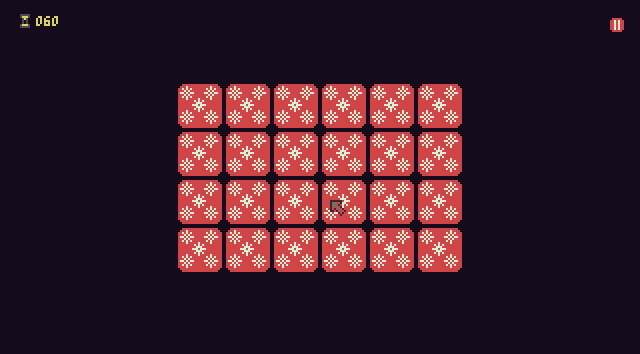

# X-masmatch

## English

X-masmatch is a small Halloween-themed card matching game.

The code for this game is licensed under GNU/GPLv3 or newer and the graphics are Public Domain or CC0 and you can get the code from [this repository](https://github.com/son-link/X-masmatch)

There are 12 characters, and they come out randomly:
* Balthasar (one of the three Wise Men)
* Christmas tree
* Dromedary
* Grapes
* Jesus
* Olentzero (Traditional Christmas character from the Basque Country)
* Present
* Puerta del Sol Clock (Madrid, Spain)
* Reno
* Santa Claus
* Snowman
* Tió de Nadal (Traditional Christmas character from Catalonia)

Some of character sprites (Jesus, Dromedary and Reno), the snowflakes are taken from 3 asset packs, the rest are created by me. Both sprites, including the rest of the sprites created for the game, will also be released under the same license. Both asset packs are from [Public Domain or CC0](http://creativecommons.org/publicdomain/zero/1.0/)

* [Tiny Dungeon](https://opengameart.org/content/tiny-dungeon) by [Kenney](https://kenney.nl/)
* [Tiny Creatures](https://opengameart.org/content/tiny-creatures) by [Clint Bellanger](ttps://opengameart.org/users/clint-bellanger) and which is an expansion pack of the previous one.
* [Pixel Art Snowflakes](https://opengameart.org/content/pixel-art-snowflakes) by [alxl](https://opengameart.org/users/alxl).

The font used is [Retro Pixel Cute Mono](https://github.com/TakWolf/retro-pixel-font) and is licensed under [MIT](https://en.wikipedia.org/wiki/MIT_License) and [OFL-1.1](https://openfontlicense.org/).

Available for Linux (x86_64 and ARM 64 bits), Windows (only x86_64) or vX-masmatchia web browser.

### How to play:

Download the package for your operating system and architecture and extract the files. Only the executable and the retro-pixel-cute-mono.bdf file are needed.

Click each card to turn it over. If when you reveal the second card both match, you have discovered a pair and 1 second will be added to your time. If you fail, 1 second is subtracted. If time runs out, the game is over.

To pause the game with the mause, click on the icon in the top right corner.

|Device     |Key/Button |Action           |
|-----------|-----------|-----------------|
|Mouse      |Move       |Move the cursor  |
|Mouse      |Left button|Flip/Pause/Select|
|Keyboard   |Arrows     |Move/Mark option |
|Keyboard   |Z          |Flip/Select option|
|Keyboard   |Enter      |Pause/Resume|
|Gamepad    |D-Pad      |Move/Mark option|
|Gamepad    |A          |Flip/Select option|
|Gamepad    |Start      |Pause/Resume|

### Downloads

* GitHub: https://github.com/son-link/X-masmatch/releases/
* Itch: https://son-link.itch.io/X-masmatch (only stable releases)
* Online: https://son-link.github.io/X-masmatch/ and Itch's page

## Español

X-masmatch es un pequeño juego de buscar parejas de cartas con temática navideña.

El código de este juego esta bajo licencia GNU/GPLv3 o nueva y los gráficos son de Dominio Publico o CC0 y podéis obtener el código en [este repositorio](https://github.com/son-link/X-masmatch)

Hay 12 personajes, y salen de manera aleatoria:
* Balthasar (uno de los tres Reyes Magos)
* Árbol de Navidad
* Dromedario
* Uvas
* Jesus
* Olentzero (Personaje tradicional navideño del País Vasco)
* Regalo
* Reloj de la Puerta del Sol (Madrid, España)
* Reno
* Santa Claus
* Muñeco de nieve
* Tió de Nadal (Personaje tradicional navideño de Cataluña)

Los sprites de varios de los personajes (Jesus, Dromedario y Reno), asi como los copos de nieve se han sacado de 3 packs de assets, el resto son de creación propia. Ambos sprites, incluidos el resto de sprites creados para el juego, también se liberarán bajo la misma licencia. Ambos packs de assets son de [Dominio Público o CC0](http://creativecommons.org/publicdomain/zero/1.0/)

* [Tiny Dungeon](https://opengameart.org/content/tiny-dungeon) por [Kenney](https://kenney.nl/)
* [Tiny Creatures](https://opengameart.org/content/tiny-creatures) por [Clint Bellanger](https://opengameart.org/users/clint-bellanger) y que es un paquete de expansión del anterior.
* [Pixel Art Snowflakes](https://opengameart.org/content/pixel-art-snowflakes) por [alxl](https://opengameart.org/users/alxl).

La fuente usada es [Retro Pixel Cute Mono](https://github.com/TakWolf/retro-pixel-font) y esta bajo las licencias [MIT](https://en.wikipedia.org/wiki/MIT_License) y [OFL-1.1](https://openfontlicense.org/)

Disponible para Linux (x86_64 y ARM 64 bits), Windows (solo x86_64) o a través del navegador web.

### Como se juega:

Descarga el paquete para tu sistema operativo y arquitectura y extrae los archivos. Solo son necesarios el ejecutable y el archivo retro-pixel-cute-mono.bdf

Pulsa cada carta para darle la vuelta. Si al revelar la segunda ambas coinciden, has descubierto una pareja y se sumará 1 segundo al tiempo. Si fallas, se te resta un segundo. Si se acaba el tiempo, se acabó el juego.

Para pausar el juego, pulsa sobre el icono que aparece en la esquina superior derecha.

|Dispositivo|Tecla/Botón|Acción           |
|-----------|-----------|-----------------|
|Ratón      |Mover      |Mueve el cursor  |
|Ratón      |Botón izq  |Voltear/Pausa/Seleccionar|
|Teclado    |Flechas    |Moverse/Marcar opción|
|Teclado    |Z          |Voltear/Seleccionar opción|
|Teclado    |Intro      |Pausar/Resumir|
|Mando      |D-Pad      |Moverse/Marcar opción|
|Mando      |A          |Voltear/Seleccionar opción|
|Mando      |Start      |Pausar/Resumir|

### Descargas

* GitHub: https://github.com/son-link/X-masmatch/releases/
* Itch: https://son-link.itch.io/X-masmatch (solo lanzamientos estables)
* Online: https://son-link.github.io/X-masmatch/ y en la página de Itch
